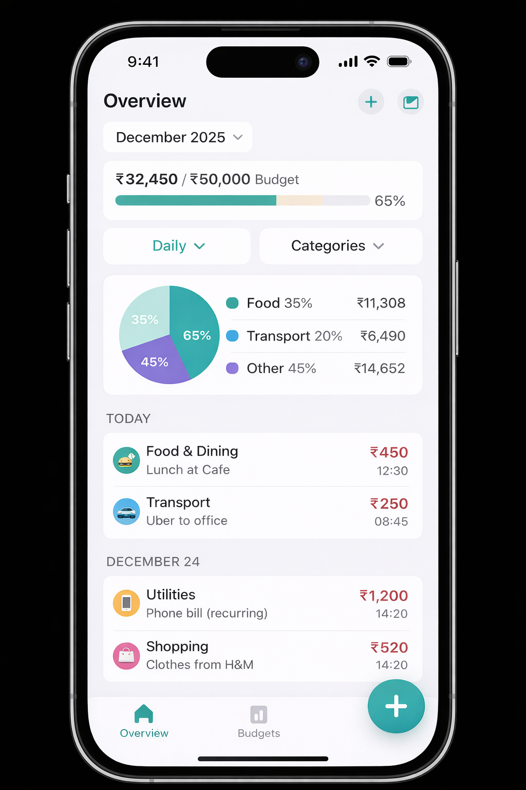

# 🏠 Home Screen – Core Dashboard

## 🎯 Purpose

Answer three questions instantly:

> 1. "How much did I spend recently?" 
> 2. "Where is my money going?" 
> 3. "Am I within budget?"

The Home Screen is **expense-first**, personal spending focused.

---

## 📸 UI Wireframes

### Home Screen Layout (Expenses View)

<!-- ```
┌─────────────────────────────────┐
│  December 2025                  │ ← Month Header
│  ₹32,450 / ₹50,000 Budget       │ ← Spending Summary
│  ████████░░░░░░░░░░░░ 65%       │ ← Progress Bar
│ [Daily ▼] [Categories ▼]        │ ← Toggle Buttons
├─────────────────────────────────┤
│                                 │
│ 📊 Pie Chart (if enabled)       │ ← Collapsible Section
│   ┌─────────────────────────┐   │
│   │       ◐                 │   │
│   │   Food 35% ₹11,308      │   │
│   │   Transport 20% ₹6,490   │   │
│   │   Other 45% ₹14,652     │   │
│   └─────────────────────────┘   │
├─────────────────────────────────┤
│ TODAY                           │ ← Date Header
├─────────────────────────────────┤
│ 🍔 Food & Dining        ₹450   │
│    Lunch at Cafe        12:30   │
├─────────────────────────────────┤
│ 🚗 Transport             ₹250   │
│    Uber to office       08:45   │
├─────────────────────────────────┤
│ DECEMBER 24             │ ← Previous Day
├─────────────────────────────────┤
│ 📱 Utilities          ₹1,200   │
│    Phone bill (recurring)       │
├─────────────────────────────────┤
│ 🛍️ Shopping             ₹520   │
│    Clothes from H&M    14:20   │
├─────────────────────────────────┤
│                                 │
│                            [+]  │ ← FAB (Add Expense)
└─────────────────────────────────┘
``` -->

### Daily View Stats

```
┌─────────────────────────────────┐
│ Daily View              [Monthly]│
├─────────────────────────────────┤
│ Today      ₹700                 │
│ Yesterday  ₹1,450               │
│ Dec 23     ₹890                 │
│ Dec 22     ₹650                 │
│ Dec 21     ₹520                 │
│ Dec 20     ₹1,240               │
│                                 │
│ Daily Avg: ₹800                 │
└─────────────────────────────────┘
```

### Empty State

```
┌─────────────────────────────────┐
│        December 2025            │
│                                 │
│         📊                       │
│                                 │
│  No expenses yet                │
│                                 │
│  Tap + to add your first        │
│  expense                        │
│                                 │
│     [Add Expense Button]        │
│                                 │
└─────────────────────────────────┘
```

---

## 🧩 Part 1: Screen Structure

The Home Screen contains **4 main sections** (top to bottom):

### 1. **Header & Quick Stats**
- Current month name (e.g., "December 2025")
- Total spent this month
- Remaining budget (if set)
- Toggle between Daily/Monthly view

### 2. **Spending Overview**
- **Daily View**: Bar chart or simple numbers showing spending per day
- **Monthly View**: Total monthly breakdown
- Small card with current daily/monthly average

### 3. **Pie Chart (Collapsible)**
- Shows expense breakdown by category
- Toggle button: "Show Categories Breakdown"
- Tap pie slice to highlight category in transactions
- Only visible when manually enabled

### 4. **Transactions List**
- Chronological order (newest first)
- Date header for grouping (e.g., "Today", "Dec 24", "Dec 23")
- Each transaction shows:
  - Category icon & name
  - Description
  - Amount
  - Time (HH:MM format)

---

## 🧩 Part 2: Data Display

### Task 2.1 – Spending Summary

**Fields Shown**
- `Total Spent This Month` → Sum of all expenses in current month
- `Monthly Budget` → Set budget amount
- `Remaining` → Budget - Total Spent (if budget exists)
- `Daily Average` → Total Spent ÷ Days Passed

**Display Rules**
- If no budget set → Show "No budget set" (clickable to add)
- If over budget → Show in red/warning color
- If within budget → Show in green

---

### Task 2.2 – Overview Options

Users can toggle between:

**Daily View**
- Show spending by day (current day + last 6 days)
- Simple format: Date | Amount

**Monthly View**
- Show total for current month
- Show total for each category

---

### Task 2.3 – Transaction List Items

Each row displays:
```
[Icon] Category Name           Amount
       Description            HH:MM
```

**Example**
```
🍔 Food & Dining              ₹450
   Lunch at Cafe              12:30

🚗 Transport                   ₹250
   Uber to office             08:45

📱 Utilities                   ₹1200
   Phone bill (recurring)      Not time-specific
```

---

### Task 2.4 – Sorting & Grouping

**Primary Sort**: Chronological (newest first)
**Secondary Group**: By date (Today, Yesterday, Dec 22, etc.)
**Recurring Bills**: Show with "recurring" badge, no time

---

## 🧩 Part 3: Interactions

### Task 3.1 – Tap Transaction
- Opens transaction detail
- Allows edit/delete
- Shows full description & notes (if any)

### Task 3.2 – Pie Chart Toggle
- Button: "Categories" at top
- Toggles pie chart visibility
- Shows breakdown: Category | % | Amount

### Task 3.3 – Add Expense (FAB)
- Floating Action Button: "+" 
- Opens Add Expense Flow
- Quick add with defaults (today, current time)

### Task 3.4 – Budget Management
- Tap "Monthly Budget" to set/edit
- Simple input dialog
- Shows remaining days & daily average

---

## 🧩 Part 4: Empty States

### First Launch
- Empty transaction list message
- "No expenses yet. Tap + to add your first expense"
- Quick tips carousel

### No Budget Set
- "Set a monthly budget to track progress"
- Clickable card to configure

---

## 📏 Layout Specifications

**Spacing**
- Top padding: 16pt (below safe area)
- Horizontal padding: 16pt
- Section spacing: 24pt
- Item spacing: 12pt

**Typography**
- Header: Bold, 24pt
- Total amount: Bold, 20pt
- Category name: Regular, 16pt
- Time: Regular, 12pt (gray)

**Colors**
- Income/positive: Green
- Expense/negative: Red
- Budget warning: Orange
- Text: Dark gray (primary), Light gray (secondary)
