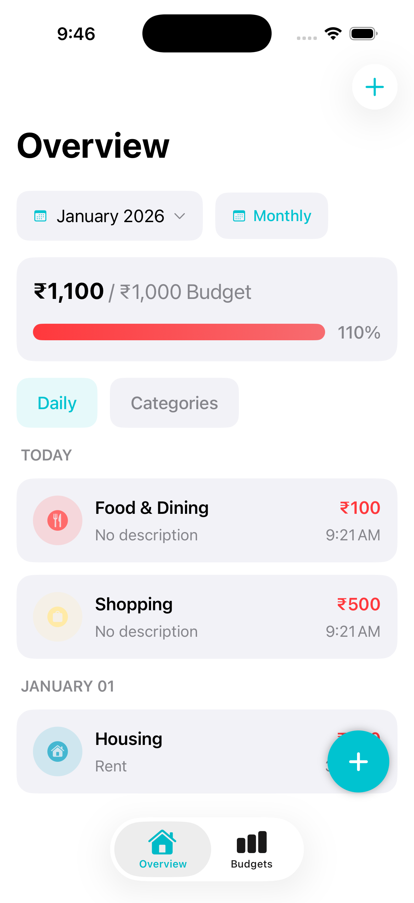
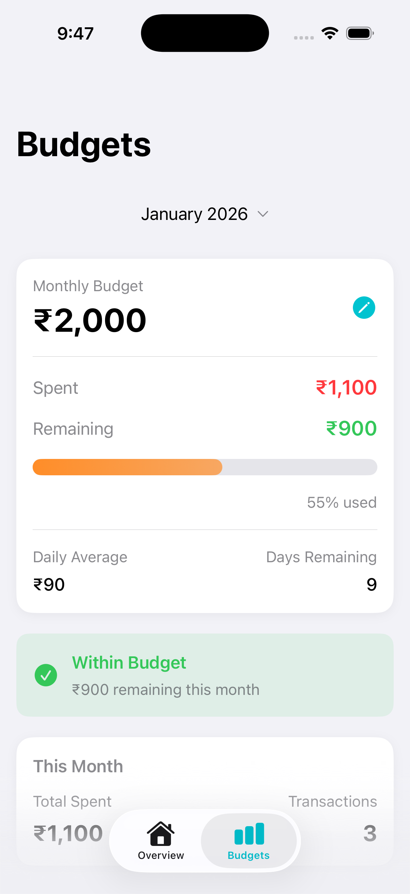
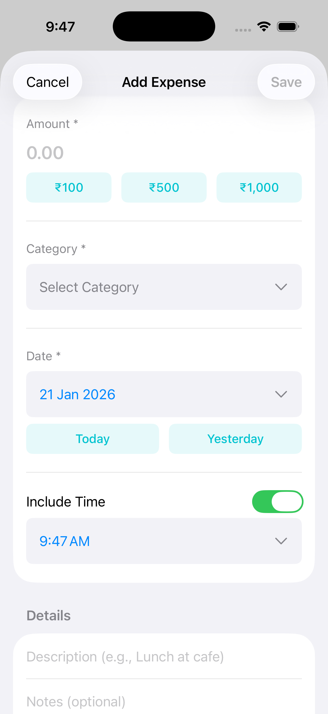

# Money Manager

A personal money manager iOS app for tracking daily and monthly expenses with budget management.

**Note: This is a work in progress application.**

## Features

- Track daily and monthly expenses
- Set and manage monthly budgets
- View spending by category with visual charts
- Quick expense entry with preset amounts
- Filter expenses by day or month
- View transaction details and history

## Screenshots

### Overview Screen


### Budgets Screen


### Add Expense Screen


## Requirements

- iOS 17.0+
- Xcode 15.0+
- Swift 5.9+

## Building and Running

1. Open `Money Manager.xcodeproj` in Xcode
2. Select a simulator or connected device
3. Build and run the project (Cmd+R)

## Project Structure

```
Money Manager/
├── Models/          # Swift Data models
├── Pages/           # Main view screens
├── Components/      # Reusable UI components
└── Services/        # Data services
```

## Technology Stack

- SwiftUI for user interface
- Swift Data for local persistence
- Charts framework for visualizations

## Current Status

The app is currently in active development. Core features are implemented and functional, with ongoing improvements and bug fixes.

## License

This project is a personal application.
