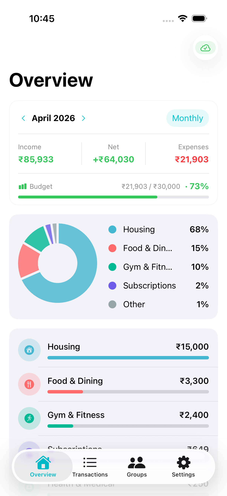
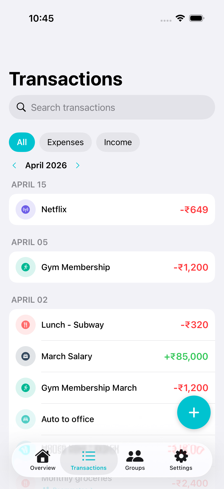
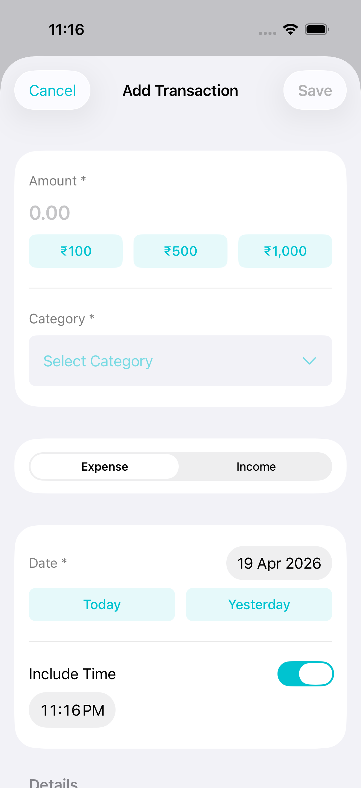
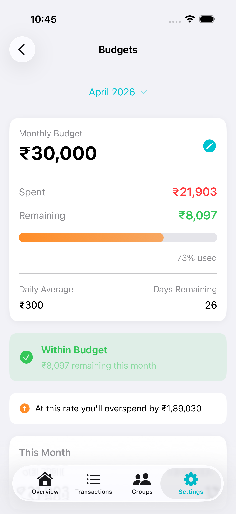
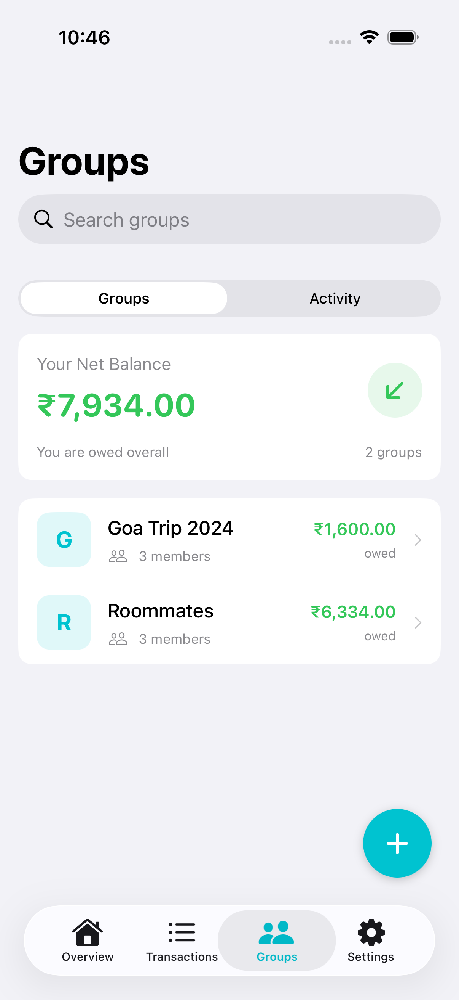
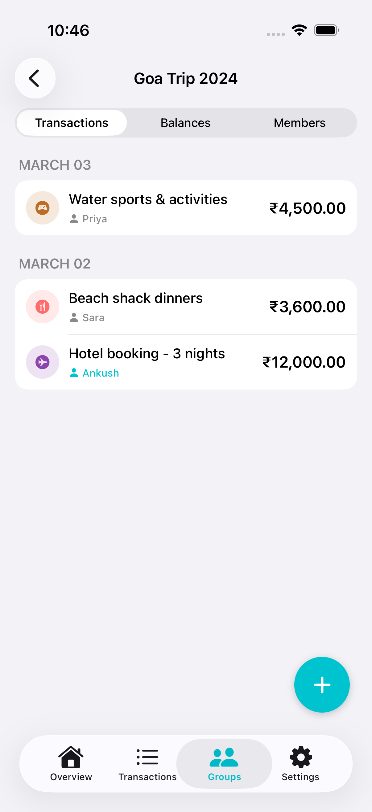

<!-- Money Manager iOS App -->

<p align="center">
  
</p>

<h1 align="center">Money Manager</h1>

<p align="center">
  A personal finance iOS app for tracking income and expenses, managing budgets, splitting costs with friends, and staying on top of your spending.
</p>

<p align="center">
  <a href="https://github.com/an01ku/money-manager-ios/actions/workflows/ci.yml">
    
  </a>
  <a href="https://github.com/an01ku/money-manager-ios/actions/workflows/ci.yml">
    
  </a>
  
  
  
  
</p>

## Features

### Transaction Tracking
- Log income and expenses with amounts, categories, notes, and dates
- Quick-add with preset amounts for fast entry
- View and filter transactions by day or month
- Detailed transaction history with search functionality

### Budget Management
- Set monthly budgets and track spending against them
- Visual breakdown of spending by category
- Dashboard with projected spending, daily averages, and remaining budget
- Over-budget alerts to keep you on track

### Recurring Transactions
- Set up recurring transactions (daily, weekly, monthly)
- Flexible scheduling — choose specific days of the week or month
- Skip weekends or specific dates
- Auto-generates transactions so you never forget a bill

### Categories
- Comes with predefined spending categories
- Create your own categories with custom names, colors, and icons
- Organize transactions the way that makes sense to you

### Server Sync
- Syncs transactions, budgets, categories, and recurring transactions with a backend server
- Offline-first — all data is stored locally and changes are queued when offline
- Replays queued changes automatically on reconnect
- Account-based with token authentication

### Additional Features
- Multi-currency support
- Export data to CSV/JSON formats
- Local-first storage with optional server sync

## Tech Stack

| Component | Technology |
|-----------|------------|
| UI Framework | SwiftUI |
| Architecture | MVVM |
| Local Storage | SwiftData |
| Charts | Swift Charts |
| Networking | Swift-APIClient (URLSession) |

## Requirements

| Requirement | Version |
|-------------|---------|
| iOS | 18.0+ |
| Xcode | 16.4+ |
| Swift | 6.0 |

## Screenshots

| Overview | Transactions | Add Transaction |
|:--------:|:------------:|:---------------:|
|  |  |  |

| Budget | Groups | Group Detail |
|:------:|:------:|:------------:|
|  |  |  |

## Architecture

```
Money Manager/
├── Models/           # Data models (Transaction, Budget, Category, etc.)
├── ViewModels/       # Business logic and state management
├── Pages/            # Screen-level views
├── Components/       # Reusable UI components
├── Services/         # Networking, sync, and core services
├── Helpers/          # Constants and utilities
├── ContentView.swift
└── Money_ManagerApp.swift
```

## Getting Started

### Prerequisites

1. Install [Xcode](https://developer.apple.com/xcode/) 16.4 or later
2. An Apple Developer account (for running on device)

### Installation

1. Clone the repository:
   ```bash
   git clone https://github.com/an01ku/money-manager-ios.git
   cd money-manager-ios
   ```

2. Open the project in Xcode:
   ```bash
   open Money\ Manager.xcodeproj
   ```

3. Select a simulator or connected device

4. Build and run: `Cmd + R`

### Development Commands

```bash
# Build the project
make build

# Run unit tests
make test-unit

# Run UI tests
make test-ui

# Capture screenshots (requires backend reachable)
make screenshots

# Run a single test class
make test-one TEST=BackupViewModelTests

# Run API integration tests (requires backend running at localhost:8080)
make test-api

# View coverage report
make coverage

# Build a Simulator release zip (used for GitHub releases)
make release

# Clean build artifacts
make clean
```

## Testing

The project includes comprehensive unit and UI tests:

- **Unit Tests** — Model validation, ViewModel logic, data transformations
- **UI Tests** — User flow verification, screen rendering tests
- **API Integration Tests** — End-to-end tests against a live backend (`make test-api`)

Run tests with:
```bash
make test-unit
```

View coverage locally with `make coverage`.

## Contributing

Contributions are welcome! Please feel free to submit a Pull Request.

1. Fork the repository
2. Create your feature branch (`git checkout -b feature/amazing-feature`)
3. Commit your changes (`git commit -m 'Add some amazing feature'`)
4. Push to the branch (`git push origin feature/amazing-feature`)
5. Open a Pull Request

## License

This project is licensed under the [MIT License](LICENSE).

---

<p align="center">Built with ❤️ and SwiftUI</p>
